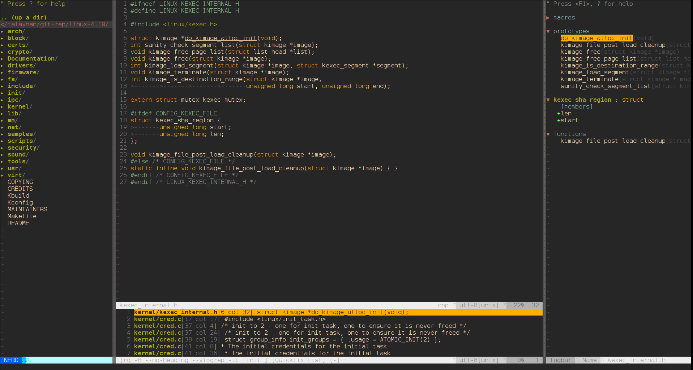
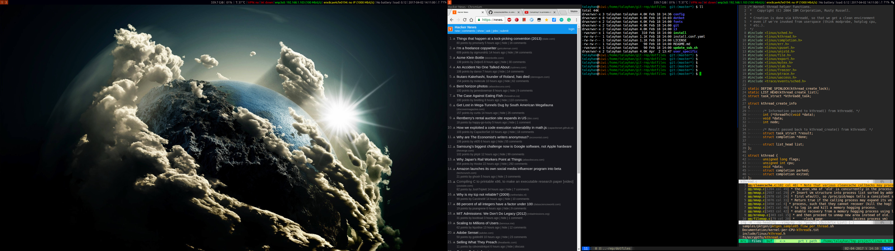

talayhan/dotfiles 
================

A collection of scripts and configurations that I use every day.

WYSIWYG
--------------------------
Vim
---

Desktop
----


License
-------
```sh
/*
 * ------------------------------------------------------------
* "THE BEERWARE LICENSE" (Revision 42):
* Talayhan wrote this code. As long as you retain this 
* notice, you can do whatever you want with this stuff. If we
* meet someday, and you think this stuff is worth it, you can
* buy me a beer in return.
* ------------------------------------------------------------
*/
```
