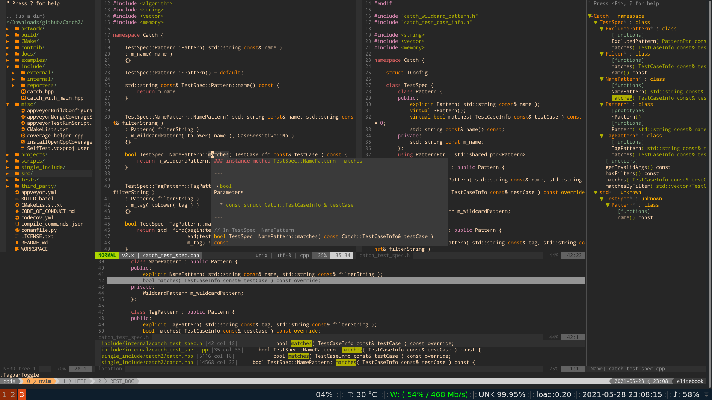

# dotfiles [](https://github.com/talayhan/dotfiles/actions)   

A collection of scripts and configurations that I use every day.



Installation
-------

1. Clone this repo
```
git clone https://github.com/talayhan/dotfiles.git ~/.dotfiles
```

2. Install dependencies for the full-featured setup
```
sudo ./user_specific/<ubuntu/centos/manajaro>_tools.sh
```

3. Run the setup
```
cd ~/.dotfiles
./install -c install_<ubuntu/centos/manjaro>.conf.yaml
```

### Contributing
Did you have trouble installing this? Please fork and create a PR.

### License
GNU GPLv3
