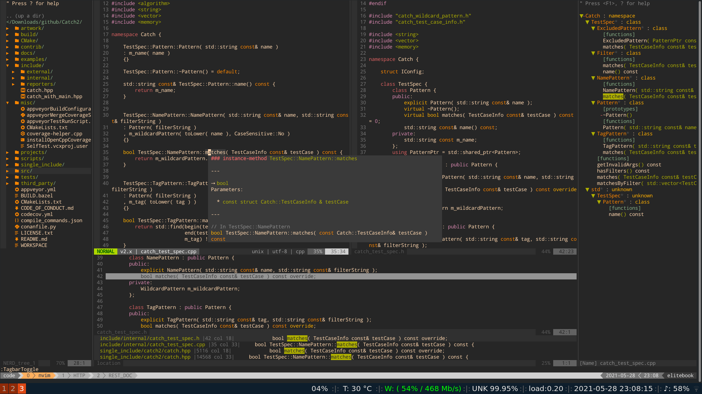

# dotfiles [](https://github.com/talayhan/dotfiles/actions)   

A collection of scripts and configurations that I use every day.



Supported platforms
-------

| Platform | Status | Notes |
| --- | --- | --- |
| Ubuntu / Debian | active | full desktop setup, i3 |
| Manjaro / Arch | active | full desktop setup, i3 + rofi |
| macOS | active | terminal-only: nvim, tmux, zsh, CLI tooling |
| CentOS 7 | legacy | kept working, no longer developed |

Installation
-------

1. Clone this repo
```
git clone https://github.com/talayhan/dotfiles.git ~/.dotfiles
cd ~/.dotfiles
```

2. Install dependencies for the full-featured setup
```
./user_specific/<ubuntu|manjaro|macos>_tools.sh
```

3. Link the configs. The platform is detected automatically.
```
./install
```

Useful flags:

```
./install -p macos       # force a platform instead of detecting it
./install -n             # print the composed manifest without linking anything
./install -n -p ubuntu   # see exactly what a given platform would link
```

How the manifests are organised
-------

`./install` composes one dotbot manifest out of `install.d/`, so shared links are
written once rather than copied per platform:

```
common + [linux] + <platform> + post
```

| File | Contents |
| --- | --- |
| `install.d/common.conf.yaml` | links every platform gets: git, tmux, nvim, zsh, vifm, scripts |
| `install.d/linux.conf.yaml` | X11 / freedesktop layer; not composed in on macOS |
| `install.d/<platform>.conf.yaml` | just what is unique to that platform |
| `install.d/post.conf.yaml` | post-link steps, composed last |

Package installation is deliberately *not* part of `./install` — it lives in the
`user_specific/*_tools.sh` scripts so that linking stays fast, non-interactive
and safe to re-run.

Testing
-------

```
./tests/verify_install.sh <platform>
```

checks that every link in a platform's manifest resolved to a real file. CI runs
the install, the verifier, and then the install again to prove idempotency, for
all four platforms — macOS on a macOS runner and Manjaro in an Arch container.

### Contributing
Did you have trouble installing this? Please fork and create a PR.

### License
GNU GPLv3
